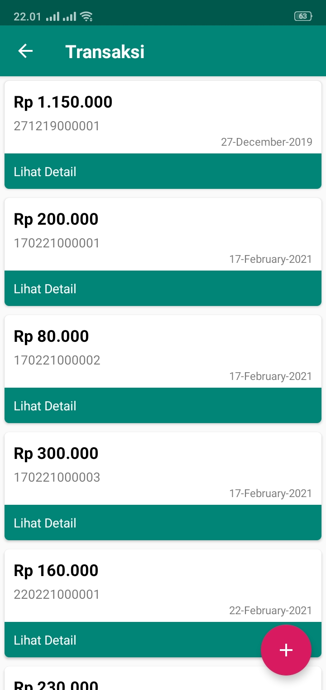
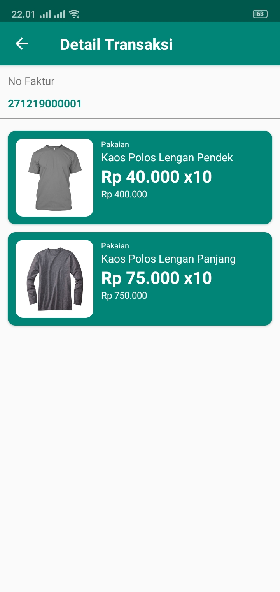
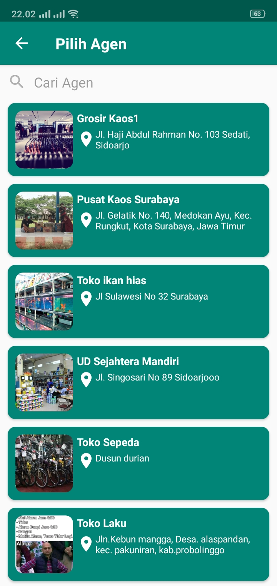

### Pengertian Prototipe

**Prototype** adalah model awal atau contoh yang dibuat untuk melakukan uji coba terhadap konsep yang sudah diperkenalkan. Prototipe biasanya dibuat untuk melakukan beberapa uji coba, seperti untuk mengetahui apakah konsep yang sudah dipaparkan bisa diimplementasikan ataupun untuk menguji selera pasar.

Sedangkan menurut Kamus Besar Bahasa Indonesia **(KBBI online)**, prototipe adalah model asli yang menjadi contoh. Bisa juga disebut sebagai contoh baku yang memiliki ciri khas. Namun jika kita lihat dari asal katanya, prototipe merupakan kata serapan Bahasa Inggris yakni **prototype**.

Apabila diterapkan dalam dunia usaha, prototipe adalah tahapan kedua sebelum temuan atau ide dilakukan produksi masal. Jadi tahap pertama adalah penemuan ide atau konsep awal. Setelah itu dilakukan pembuatan prototipe.

Dengan adanya prototipe, kita bisa meminimalisir kesalahan dalam pengambilan keputusan. Jika terjadi masalah atau ketidak sesuaian dengan selera pasar, maka prototipe akan dilakukan perbaikan. Jika ternyata ide atau konsep dapat di implementasikan dan sesuai dengan kebutuhan pasar, maka akan dilakukan produksi masal.

### Tujuan Prototipe

**_Prototipe_** bertujuan agar produk yang diluncurkan sesuai dengan permintaan pasar. Prototipe bisa menjadi jembatan antara produsen dan konsumen untuk mewujudkan produk yang sesuai. Dengan begitu, produk yang diluncurkan diminati oleh konsumen.

Adanya **_prototipe_** ini juga bisa menghemat biaya produksi karena produsen tidak perlu melakukan ‘trial and error’. Bisa dibayangkan, berapa besar biaya produksi yang dikeluarkan jika produsen tidak memiliki prototipe dan asal mengeluarkan produk.

Pengusaha pun bisa menghemat waktu untuk melakukan riset apabila sudah menentukan **_prototipe_**. Karena, produk yang diproduksi sudah memiliki konsep dan samplenya sudah sesuai dengan permintaan pasar, bahkan beberapa ada masukan dari konsumen.

### Manfaat prototipe

Kenapa investor memerlukan prototipe? dan apa saja manfaatnya? Ada beberapa manfaat yang diperoleh produsen atau penemu ide ketika membuat prototipe, di antaranya :

1. Prototipe merupakan tahapan mengubah konsep yang belum pasti ke wujud yang riil. Dengan menggunkaan prototipe kita bisa memastikan bahwa konsep bisa diimpementasikan dan bisa digunakan untuk lebih memahami kebutuhan konsumen. Ide-ide di pikiran bisa tertuang dalam bentuk konkret sesuai kebutuhan konsumen.
2. Walaupun prototipe tidak menggambarkan semua fungsi dan tujuan aplikasi, gambaran sederhana itu dapat mewakili minat pasar. Adanya interaksi antara produsen dengan konsumen, memungkinkan produsen mendapatkan masukan dari konsumen berdasarkan pengalaman menggunakan produk.
3. Dengan adanya prototipe dapat memudahkan Programer untuk mempresentasikan Aplikasi yang akan diluncurkan di hadapan perusahaan/lembaga. Adanya prototipe memudahkan perusahaan mendapatkan gambaran fisik aplikasi yang akan diluncurkan. Gambaran fisik itu juga bisa menentukan keberhasilan aplikasi dan memutuskan perusahaan apakah akan mendanai peluncuran aplikasi itu atau tidak.
4. Seperti yang sudah kami katakan, salah satu tujuan dari pembuatan prototipe adalah merealisasikan konsep kedalam produk jadi, yang tentu saja akan ada “trial dan eror”. Setelah prototipe sukses, baru akan dilakukan produksi masal. Dengan menunda produksi masal, dan memilih untuk membuat prototipe tentu akan bisa menghemat banyak biaya jika produk tersebut ternyata memiliki kekurangan.

### Contoh Prototipe

Contoh sederhananya begini, seorang pengusaha ingin mengembangkan aplikasi penjualan. Kemudian, ia melakukan analisa kebutuhan konsumen, produk penjualan seperti apa yang diinginkan konsumen. Ternyata, mayoritas konsumen menginginkan aplikasi penjualan yang mempermudah transaksi pembelian.

  
  
  
  
  
 
